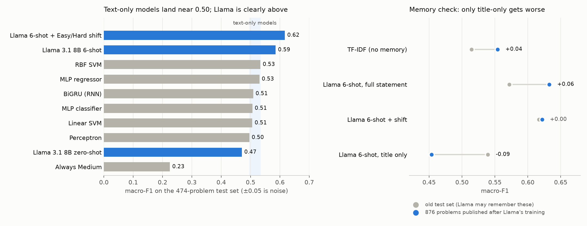

# LeetCode difficulty estimator

Can a model tell how hard a programming problem is just by reading it? Given a LeetCode problem statement, predict
its difficulty: **Easy / Medium / Hard**. Classic machine learning, a recurrent network and a pretrained
LLM (Llama 3.1 8B) are compared on one shared, leak-free test set.

**Key findings**

- **Text-only models plateau at about 0.50 macro-F1.** Five tuned TF-IDF + scikit-learn models and a BiGRU trained
  from scratch all land within 0.50–0.53 (always answering "Medium": 0.23).
- **Llama 3.1 8B, run locally (4-bit, MLX), reaches 0.62** with 6 solved examples in the prompt, calibration and a
  macro-F1-tuned decision rule. It reads next-token probabilities, no text generation.
- **The lead is real, not memorised.** Llama *does* remember LeetCode: with only the problem title it is almost as
  good as with the full statement. But on 876 problems published after its training cutoff, its full-statement score
  holds (0.63) while the title-only score drops by 0.09.
- **Revisiting the 2024 version found a data leak** (the downsampling kept the oldest problems of each class, so
  problem age predicted the label) that had inflated the reported accuracy. Fixed, with all data kept.



## Authors and contributions

The project started in 2023–24 as a semestral project for the Neural Networks course at MFF, Charles University
(Faculty of Mathematics and Physics), by **Juraj Trappl** and **Filip Mihal**. In 2026 Juraj revisited it alone:
reviewed the original work, fixed its mistakes and extended it. The 2024 slides and plots were removed, as their
numbers were affected by the leak described below (they are still in the git history).

**2023–24 (course project)**

| Juraj Trappl | Filip Mihal |
|---|---|
| Data collection: LeetCode GraphQL scraper and dataset (`data/leetcode_graphql.py`) | Text preprocessing: HTML-free problem texts |
| TF-IDF + MLP experiments (PCA / t-SNE reductions), trained on MetaCentrum | scikit-learn pipeline: TF-IDF features, perceptron, linear and RBF SVM, MLP classifier and regressor, SVD / feature selection |
| RNN with Keras Tuner | Visualisation notebook |
| BERT contextual embeddings + MLP (pooling variants, CNN feature extraction, SMOTE), class downsampling | |
| Llama 2 few-shot prompting, slides, README | |

**2026 (rework, Juraj Trappl)**

- Found and fixed the problems of the original version: the downsampling leak, HTML cleaning that turned
  `10^5` into `105`, the RNN vocabulary built on test data, and a Llama 2 prompt that showed the same example with
  all three labels (details under [What was wrong in the 2024 version](#what-was-wrong-in-the-2024-version)).
- One evaluation protocol for every model: all data, one stratified train/test split, class weights, macro-F1 / QWK
  with bootstrap intervals; shared config and seeding (`config.py`, `data/dataset.py`).
- sklearn models re-tuned with the same random-search budget each; RNN rebuilt (order-of-magnitude number tokens,
  masked BiLSTM/GRU, tuned and CV-checked).
- New model: Llama 3.1 8B via MLX with calibration and a memorisation check on newly fetched, post-cutoff problems.
- Engineering: MLflow experiment tracking (local, Docker UI), secrets moved to `.env` and purged from history,
  resumable caches and "reuse what's already trained" re-runs, dataset rebuilt from committed problem lists.

## Quick start

Python 3.12. The Llama notebook needs a Mac with Apple Silicon (MLX); everything else runs anywhere.

```sh
python -m venv .venv && source .venv/bin/activate
pip install -r requirements.txt
python data/rebuild_dataset.py     # downloads the problem statements (not in the repo, see Data), ~1 hour
jupyter lab                        # open any notebook and run it
docker compose up -d               # optional: MLflow UI with all runs on http://localhost:5050
```

## Task

Given a text description of a programming problem, predict its difficulty: Easy, Medium or Hard. Both
classification and regression (predict a number, cut it into three classes) approaches are compared.

## Data

2,366 free LeetCode problems, downloaded in December 2023 through LeetCode's GraphQL API (~51% Medium, 27% Easy,
22% Hard), plus 876 problems published later (ID 3000–4059) as an unseen test set for the memorisation check.

**The problem statements are LeetCode's content, so they are not in this repository.** The repo contains only the
problem lists with their labels, in the original order (`data/problem_list.json`, `data/new_problem_list.json`);
`python data/rebuild_dataset.py` downloads the statements for exactly those problems, so the split and every result
line up. (LeetCode occasionally edits a statement, so a rebuilt dataset can differ slightly.)

All models use `data/dataset.py`: it keeps **all** problems (no downsampling), makes one stratified 80/20 train/test split
(validation, when needed, is carved out of the training part), and handles the imbalance with balanced class weights.
Always predicting Medium already gives ~51% accuracy, so models are compared by **macro-F1** (every class counts equally)
and **QWK** (quadratic weighted kappa: Easy→Hard is a worse mistake than Easy→Medium) on the same 474-problem test set.
With that test size, the 95% interval on macro-F1 is roughly ±5 points.

## Models

### Classification

- Perceptron, Linear SVM, RBF SVM, MLP classifier (`sklearn_pipeline.ipynb`)
- Bidirectional LSTM/GRU trained from scratch (`rnn.ipynb`)
- Llama 3.1 8B Instruct, zero- and few-shot (`llama_few_shot.ipynb`)

### Regression

- MLP regressor

## Configuration

Settings that must be identical for every model live in `config.py`: seed, split sizes, CV folds, class weighting,
text cleaning, pretrained model IDs, output folders and plot DPI. Every script and notebook imports `CFG` from there
and calls `set_seed()`, which seeds Python, NumPy and whichever of TensorFlow / PyTorch is loaded.
Model-specific knobs (batch size, epochs, tuner ranges, TF-IDF settings) stay next to their model.

Override any setting without editing code, in the shell or in `.env` (see `.env.example`):

```sh
python config.py                          # print all settings
SEED=7 jupyter lab                        # different seed for split + models
SAMPLE_LIMIT=300 jupyter lab              # dry run on a stratified 300-problem sample
```

Outputs: plots → `confusion_matrices/`, saved models and best hyperparameters → `trained_models/`,
caches, result tables and tuner trials → `results/`.

Re-running a notebook reuses what was already trained, as long as its settings haven't changed: the sklearn
searches (`trained_models/sklearn_<model>.joblib`, only the best setting is refitted), the RNN re-check and model
(`rnn.keras` + `rnn_meta.json`), and the cached Llama answers in
`results/`. A changed setting retrains that part automatically; `RESEARCH = True` / `RETRAIN = True` at the top
of a notebook forces it.

## Experiment tracking (MLflow)

Every notebook logs its runs through `tracking.py` into a local MLflow store in `mlflow/` (no server, no account,
no license). Experiments are per model family, runs share one naming scheme: `<family>-<model>[-<variant>]-s<seed>`.

| Notebook | Experiment / runs | What is logged |
|---|---|---|
| `sklearn_pipeline.ipynb` | `.../sklearn`: `sklearn-<model>-tuned-s42` ×5, `sklearn-comparison-s42` | search space, best setting, CV + test scores, confusion matrix, every tried setting as a table |
| `rnn.ipynb` | `.../rnn`: `rnn-bi<lstm\|gru>-tuned-s42` | every tried setting, CV re-check of the top 3, per-epoch curves, test scores, confusion matrix |
| `llama_few_shot.ipynb` | `.../llama`: `llama-llama3.1-8b-<0\|6>shot-s42` | raw + calibrated test scores, log-loss / ECE, confusion matrices, prompt settings |

Every run also stores all of `config.py` as parameters (`settings.*`) and the git commit, and runs with
`SAMPLE_LIMIT` set are tagged `dry_run`, so you can filter them out.

Browse the runs with `docker compose up -d` → http://localhost:5050 (or, without Docker,
`mlflow ui --backend-store-uri sqlite:///mlflow/mlflow.db`). `TRACKING_ENABLED=false` turns logging off; without
mlflow installed everything still runs, just without logging.

## Results

Everything below is measured on the **same 474-problem test set** (the real class mix: 129 Easy / 242 Medium /
103 Hard), with settings chosen on training data only. **Macro-F1** is the main score (each class counts one
third); always answering Medium gets 0.511 accuracy but only 0.225 macro-F1. With 474 test problems the 95%
interval on macro-F1 is about **±0.05**, so smaller differences are noise.

### Overview

| Model | Notebook | Accuracy | Macro-F1 | QWK |
|---|---|---|---|---|
| Always Medium | – | 0.511 | 0.225 | 0.000 |
| Llama 3.1 8B zero-shot, calibrated | `llama_few_shot` | 0.548 | 0.470 | 0.363 |
| MLP classifier, tuned (best sklearn model by CV) | `sklearn_pipeline` | 0.530 | 0.506 | 0.389 |
| Perceptron / linear SVM / RBF SVM / MLP regressor, tuned | `sklearn_pipeline` | 0.525–0.576 | 0.496–0.533 | 0.375–0.447 |
| BiGRU, tuned | `rnn` | 0.544 | 0.509 | 0.351 |
| Llama 3.1 8B 6-shot (variant picked on the calibration set) | `llama_few_shot` | 0.589 | **0.586** | **0.563** |
| Llama 3.1 8B 6-shot, calibrated + Easy/Hard shift for macro-F1 | `llama_few_shot` | 0.648 | **0.617** | **0.577** |

**What it says, in short**

1. **Every model that only reads the text lands at about 0.50 macro-F1.** The five tuned sklearn models (TF-IDF
   features) and the RNN are all within 0.50–0.53, inside each other's noise band. How the text is turned into
   numbers matters much less than one would hope.
2. **Llama is the only model clearly above that, and the lead is real.** It *has* memorised LeetCode: given only
   the title, it is almost as good as with the whole statement. But on 876 problems published after its training
   cutoff it does just as well (6-shot macro-F1 0.63 vs 0.55 for a TF-IDF model), so its score with the full
   statement doesn't depend on that memory (see the Llama section).
3. **Hard is the weak class for everyone.** Hard recall is 0.29–0.44 for the sklearn models and the RNN; most Hard
   problems are called Medium.
4. The old ~58–62% accuracy numbers of the 2024 version were inflated by a leak in the downsampling (below).

### Shallow models (`sklearn_pipeline.ipynb`)

Five models, each with the same random-search budget (30 settings × 5-fold CV on the training part): TF-IDF word
and character n-grams, lowercasing, feature reduction (all n-grams / top-k% by label association / SVD),
class-weight strength, and each model's own knobs. The model to trust is the one with the best **CV** score; the
test columns only confirm.

| Model | CV macro-F1 | Test accuracy | Test macro-F1 | Test QWK | Recall Easy / Medium / Hard |
|---|---|---|---|---|---|
| MLP classifier | **0.565 ± 0.026** | 0.530 | 0.506 | 0.389 | 0.55 / 0.58 / 0.39 |
| MLP regressor (ordinal cut-offs) | 0.549 ± 0.027 | 0.555 | 0.530 | 0.439 | 0.55 / 0.62 / 0.41 |
| RBF SVM | 0.544 ± 0.018 | 0.576 | 0.533 | 0.447 | 0.62 / 0.67 / 0.29 |
| Linear SVM | 0.541 ± 0.012 | 0.544 | 0.506 | 0.390 | 0.57 / 0.63 / 0.31 |
| Perceptron | 0.523 ± 0.014 | 0.525 | 0.496 | 0.375 | 0.54 / 0.60 / 0.34 |

All five are within 0.04 of each other on test, i.e. statistically tied. The regressor, which knows that
Easy < Medium < Hard, has the best QWK together with the RBF SVM. Best settings: `trained_models/sklearn_best_params.json`;
every tried setting: `results/sklearn_search_<model>.csv` and MLflow. Confusion matrices:
`confusion_matrices/sklearn_tuned_all.png`.

### RNN (`rnn.ipynb`)

Bidirectional LSTM/GRU trained from scratch on statement + constraints, numbers turned into order-of-magnitude
tokens (`10^5` → `<1e5>`). 20 random settings (11 min), the top 3 re-checked with 3-fold CV, the winner trained
once more and tested once.

* Winner: **BiGRU**, 64 units, mean pooling, 64-dim embeddings, dropout 0.3, class-weight power 0.5
  (`trained_models/rnn_best_hp.json`).
* CV macro-F1 0.522 ± 0.008 → test accuracy 0.544, **macro-F1 0.509**, QWK 0.351.
* Recall Easy / Medium / Hard: 0.42 / 0.66 / 0.44. It overfits quickly (training macro-F1 ~0.85 after a few
  epochs vs ~0.48 on validation), which early stopping catches.


### Llama 3.1 8B Instruct (`llama_few_shot.ipynb`)

4-bit, run locally with MLX (≤16 GB). No text generation: we read the model's next-token probabilities for
`Easy` / `Medium` / `Hard` (they get 99.8% of the probability mass). Calibration (temperature + class bias) is
fitted on 600 training problems; the variant to report is chosen on those, not on test.

| Variant | Calibration-set macro-F1 | Test accuracy | Test macro-F1 | Test QWK | Test ECE |
|---|---|---|---|---|---|
| 0-shot raw | 0.385 | 0.544 | 0.369 | 0.217 | 0.222 |
| 0-shot calibrated | 0.495 | 0.548 | 0.470 | 0.363 | 0.049 |
| **6-shot raw** (chosen) | **0.626** | 0.589 | **0.586** | **0.563** | 0.142 |
| 6-shot calibrated | 0.583 | 0.637 | 0.572 | 0.531 | 0.047 |
| 6-shot calibrated + Easy/Hard shift | – | 0.648 | 0.617 | 0.577 | – |

* Two solved examples per class help a lot (0.47 → 0.59). Calibration fixes the confidence (ECE 0.14 → 0.05)
  but, as it optimises log-loss, it trades Hard predictions for Medium; the extra Easy/Hard shift (tuned for
  macro-F1 on the calibration set) buys them back: Hard recall 24% → 46%, macro-F1 0.617.

**Does it read the problem, or remember it?** Same model, but the prompt contains only the problem *title*:

| Input | Accuracy | Macro-F1 | QWK |
|---|---|---|---|
| Llama 0-shot, full statement | 0.548 | 0.470 | 0.363 |
| Llama 0-shot, **title only** | 0.582 | 0.493 | 0.396 |
| Llama 6-shot, full statement | 0.637 | 0.572 | 0.531 |
| Llama 6-shot, **title only** | 0.616 | 0.539 | 0.462 |
| TF-IDF + logistic regression, title only (no memory) | 0.401 | 0.380 | 0.144 |

A title alone carries little information (the no-memory model gets 0.38), yet Llama is about as good with the title
as with the whole statement: the LeetCode problems and their labels were in its training data, and it remembers them.

**Does the memory inflate the real score?** The fair test is on problems it cannot have seen:
`data/fetch_new_problems.py` fetched the 876 problems with ID 3000–4059 (184 Easy / 433 Medium / 259 Hard), all
published after Llama 3.1's training cutoff (December 2023). Nothing is re-fitted: the same prompts, calibration and
Easy/Hard shift as above.

| Input | Old test macro-F1 | New problems macro-F1 | Change | New QWK |
|---|---|---|---|---|
| TF-IDF + logistic regression, full statement (no-memory control) | 0.515 | 0.554 | +0.04 | 0.451 |
| Llama 0-shot calibrated, full statement | 0.470 | 0.533 | +0.06 | 0.437 |
| Llama 6-shot calibrated, full statement | 0.572 | **0.633** | +0.06 | 0.587 |
| Llama 6-shot calibrated + Easy/Hard shift | 0.617 | 0.622 | +0.00 | **0.593** |
| Llama 0-shot calibrated, **title only** | 0.493 | 0.429 | **−0.06** | 0.292 |
| Llama 6-shot calibrated, **title only** | 0.539 | 0.454 | **−0.09** | 0.334 |

* The new problems are a bit *easier* to classify for everyone (the no-memory control gains 0.04).
* **Title only** is the one input that gets worse: on unseen problems a title can't trigger a memory. That confirms
  the memorisation.
* **Full statement** gains as much as the control, so it was not being carried by memory. Llama's lead over the
  no-memory model is, if anything, larger on unseen problems (0.08 vs 0.06 macro-F1). It really reads the problem.
* With the shift, Hard recall on the new problems is 69% (179 / 259). The cost is Medium problems called Hard
  (163 / 433): the new set has more Hard problems (30% vs 22%), and the shift was tuned on the old mix.


### What was wrong in the 2024 version

* **Downsampling leak.** The balanced set kept the *first* 514 problems of each class in LeetCode-ID order: all Hard
  problems, but Medium only from the oldest ~940. Problem age then predicted the label (a decision tree on the
  problem position alone reached ~56%), which inflated the reported ~58–62% accuracy, and a third of the problems
  (824 of 2366) were thrown away. Now all problems are kept, class weights handle the imbalance, and macro-F1 is reported.
* **HTML cleaning** turned `10<sup>5</sup>` into `105`, so "n ≤ 10^5" read as "n ≤ 105" in ~65% of problems. Fixed
  (`10^5`). For TF-IDF it hardly matters (both are just n-grams), but for a model that reads the text,
  "n ≤ 105" and "n ≤ 100000" are different problems.
* **Llama 2 prompt bug.** The 2024 prompt showed the same Easy example three times, labelled easy, medium and hard;
  its ~40% accuracy was below always guessing Medium (51%).
* **RNN.** Vocabulary built from all problems (test included), stopwords like "at most" removed, every number
  replaced by one `<NUMBER>` token (losing the constraint sizes), training data never shuffled.

## Final words

- generally a hard task: difficulty labels are partly subjective, and a problem's text says only so much about them
- with an honest setup (no leak, one shared test set, tuned by CV) every model that only reads the text ends up
  around 0.50 macro-F1; more data or a model that understands algorithms would be needed to go further
- the only model clearly above that is Llama 3.1 8B; it has memorised LeetCode, but it keeps its lead on problems
  published after its training, so the lead comes from reading, not remembering
- fun project :-)
